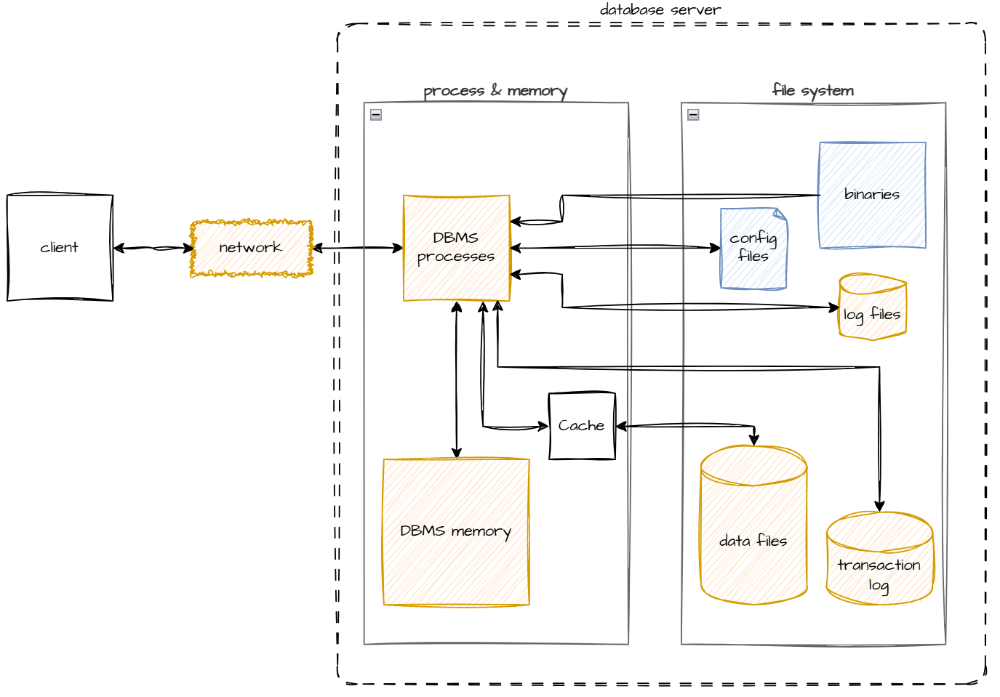

# DBMS Lab   
    
[Server Setup](server-setup.md)    
[DBMS Setup](dbms-setup.md)    
[Database Objects](database-objects.md)    
[Cluster Configuration](cluster-configuration.md)    
[Backup &amp; Recovery](backup-and-recovery.md)    
[Client Configuration](client-configuration.md)    
[Questions](questions.md)    
   
